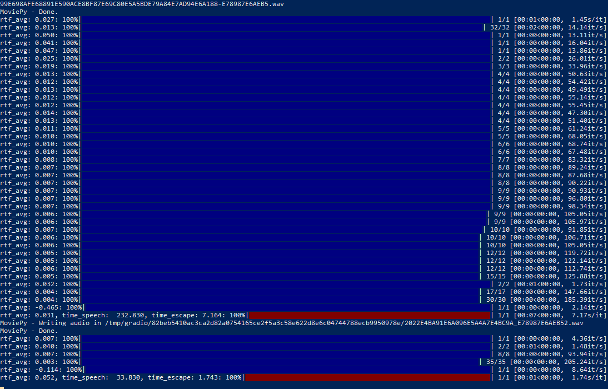

# GPU 部署 - GPU Deployment



使用GPU加速推理，速度快的飞起（CPU一般每秒是个位数甚至不到1的步数）

## Docker 环境配置
先看一下文档，做好docker调用gpu的配置工作。
[Docker部署机器学习项目教程](https://blog.motorbottle.site/archives/308)

## 部署镜像
创建一个目录，例如~/asr，在目录中clone本项目。在目录中添加`docker-compose.yml`以及`.env`文件
```
version: '3.8'
services:
  asr-gpu:
    image: nvidia/cuda:11.6.1-runtime-ubuntu20.04
    runtime: nvidia
    container_name: asr-gpu
    environment:
      - NVIDIA_VISIBLE_DEVICES=0
    volumes:
      - ./Audio-Processor:/App
      - ./.env:/App/.env
    shm_size: '64g'
    ports:
      - "7863:7860"
    stdin_open: true
    tty: true
```

Follow上面的配置教程安装conda。

安装好conda并激活环境:
```
conda create -n asr python=3.10 -y
conda activate asr
```

安装torch相关包：
```
conda install pytorch==1.13.1 torchvision==0.14.1 torchaudio==0.13.1 pytorch-cuda=11.6 -c pytorch -c nvidia
```

安装其余包：
```
cd App
pip install -r requirements_cuda_docker.txt --no-deps
```

验证可以成功运行后，docker commit <你的容器id> asr-llm-gpu:latest

```
version: '3.8'
services:
  asr-llm-gpu:
    image: asr-llm-gpu:latest
    runtime: nvidia
    container_name: asr-llm-gpu
    environment:
      - NVIDIA_VISIBLE_DEVICES=0
    volumes:
      - ./Audio-Processor:/App
      - ./.env:/App/.env
    shm_size: '64g'
    ports:
      - "7861:7860"
    stdin_open: true
    tty: true
    command: >
      bash -c "source /opt/miniconda/bin/activate && conda activate asr && cd App && python funclip/launch.py --listen"
```