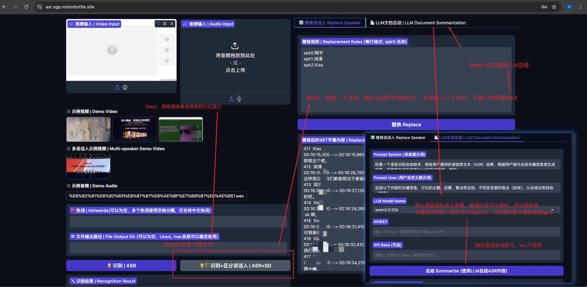

# 音视频总结

[简体中文](./README_zh.md) / [English](./README.md)

本项目基于开源项目 **FunClip** 进行修改，集成了自动语音识别 (ASR)、说话人分离、SRT 字幕编辑以及基于 LLM 的总结功能。项目使用 **Gradio** 提供了一个直观易用的用户界面。

---

更新: 添加了本地部署/Docker部署的GPU推理支持. [Docker的GPU加速请查看这个](./Docker_GPU.md)

---


示例：服务器部署+私有LLM API

## 📜 **致谢**

本项目基于开源项目 **[FunClip](https://github.com/alibaba-damo-academy/FunClip)**（由 [阿里巴巴达摩院](https://github.com/alibaba-damo-academy) 提供），在此基础上进行了功能修改，项目功能包含：

- **ASR 总结功能**：通过 LLM（如 OpenAI GPT、自定义 API）进行语音识别结果的总结。
- **动态 SRT 替换**：支持通过映射规则替换字幕中的说话人标识。
- **轻量级部署**：提供 Docker 镜像与 Python 本地部署支持。

---

## 🎯 **功能介绍**

1. **自动语音识别 (ASR)：**  
   - 支持视频和音频输入。  
   - 输出文本内容及 SRT 字幕。

2. **说话人分离 (SD)：**  
   - 在多说话人音频/视频中识别不同说话人。

3. **SRT 字幕编辑：**  
   - 支持自定义映射替换字幕中的说话人标识。

4. **LLM 总结：**  
   - 使用 GPT 模型对 ASR 结果进行总结和提取关键信息。  
   - 支持自定义 API 配置。

5. **灵活部署：**  
   - 提供 Docker 镜像，适用于生产环境。  
   - 支持 Python 环境进行本地开发和测试。

---

## 🛠 **运行环境**

### 系统（两种部署方式）
- **Docker**：适用于容器化生产部署。
- **Python 3.9+**：适用于本地开发和测试。

### 依赖
项目依赖可参考 `requirements.txt` 文件。

---

## 🚀 **项目部署**

### 1. **Docker 部署**

#### **构建 Docker 镜像**
使用以下命令构建 Docker 镜像：
```bash
docker build -t audio-processor:latest .
```

#### **通过 Docker Compose 部署**
使用以下 `docker-compose.yml` 文件进行部署：

```yaml
version: '3.8'

services:
  audio-processor:
    image: audio-processor:latest  # 使用已构建的镜像
    container_name: audio-processor
    ports:
      - "7860:7860"  # 端口映射
    volumes:
      - ./.env:/app/.env  # 仅映射 .env 文件
    working_dir: /app  # 设置工作目录
    restart: unless-stopped  # 确保服务异常退出时重启
```

启动部署：
```bash
docker-compose up -d
```

Gradio 用户界面将在以下地址访问：  
`http://localhost:7860`

---

### 2. **Python 本地部署**

#### **设置环境**

1. 克隆仓库：
   ```bash
   git clone https://github.com/MotorBottle/Audio-Processor.git
   cd audio-processor
   ```

2. 安装依赖：
   ```bash
   python3 -m venv .venv
   source .venv/bin/activate
   pip install --no-cache-dir -r requirements.txt
   ```

3. 安装 **FFmpeg**（Linux 用户）：
   ```bash
   sudo apt-get update
   sudo apt-get install -y ffmpeg
   ```

   （Mac 用户使用 brew 安装）
   ```bash
   brew install ffmpeg
   ```

#### **运行项目**

使用以下命令启动 Gradio 服务：
```bash
python funclip/launch.py --listen
```

Gradio 用户界面将在以下地址访问：  
`http://localhost:7860`

---

## ⚙️ **环境变量配置**

项目支持通过 `.env` 文件配置账户及 API 密钥等信息。

示例 `.env` 文件：
```bash
USERNAME=motor
PASSWORD=admin
OPENAI_API_KEY=your_openai_key
OPENAI_API_BASE=https://your-custom-api.com
```

---

## 🎥 **使用方法**

1. 上传音频或视频文件。
2. 执行 **ASR 识别** 或 **说话人分离**。
3. 使用映射规则替换 SRT 字幕中的说话人名称。
4. 使用 **LLM 总结** 功能对 ASR 结果进行总结，提取主题、要点和结论。

---

## 🔗 **贡献与开源协议**

本项目基于 **MIT 协议** 开源，欢迎提交贡献。

原项目 FunClip 地址：  
[FunClip on GitHub](https://github.com/alibaba-damo-academy/FunClip)

---